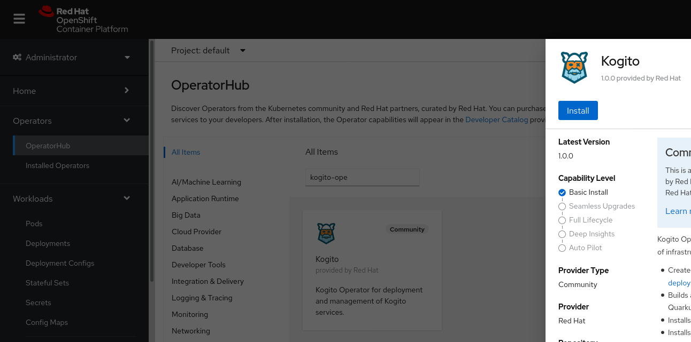
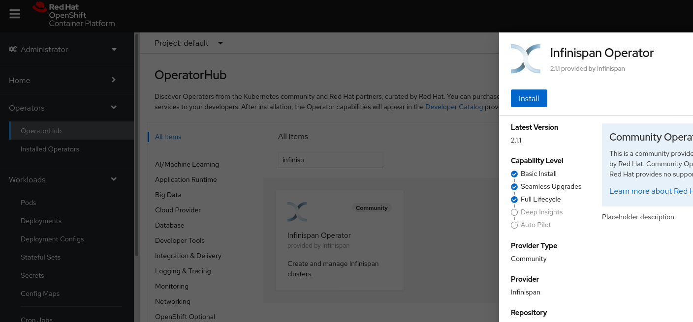
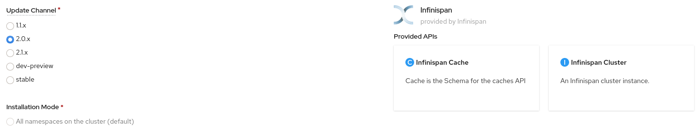
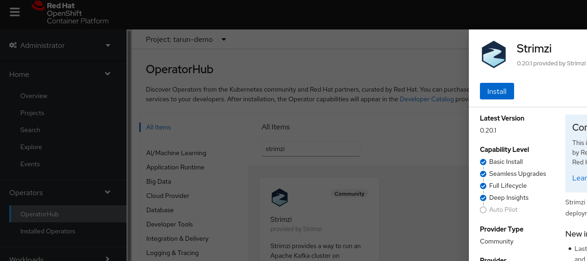

# Kogito Workshop Devconf.in 2020 

Disclaimer: This workshop is for intermediate level developers.

Table of Contents
=================

* [1) Pre Requisites](#1-pre-requisites)
* [2) Deployment](#2-deployment)


## 1 Pre requisites
- Make sure you have admin access to Openshift Cluster for setting up a local cluster see [CRC](https://access.redhat.com/documentation/en-us/red_hat_codeready_containers/1.19/html/getting_started_guide/installation_gsg?extIdCarryOver=true&sc_cid=701f2000001Css5AAC)
- After logging in to your cluster go to OperatorHub and install `kogito-operator`  keeping everything as default

- Install the `Infinispan Operator` on `2.0.x` channel

`Note: Infinispan might not work if anyother channel is used`

- Install the `Strimzi Operator` for kafka on stable channel


You would be able to see all these three operators in `Installed Operators` and `Deployments` section of your admin console

## 2 Deployment
Before proceeding verify that all `pods` of all the pre-required operators are in running and showing `1/1 READY` status
For deploying the kogito-travel-agency example as seen in the workshop on your cluster just run a simple command from this directory:

```shell-script
kubectl apply -f infra/
```
Make sure Infra is ready before proceeding:
```shell-script
kubectl wait --for=condition=ready pod  --selector=app=infinispan-pod --timeout=5m
kubectl wait --for=condition=ready pod  --selector=strimzi.io/kind=Kafka --timeout=5m
```

After Infra is ready let's deploy our Travel and Visa Service
```shell-script
 kubctlt apply -f travel-agency/ 
```

After the deployment just relax and sit back while operator take care of the rest.
Around 10 minutes later verify if all the build pod is showing complete status and other pods are all in running status

The OCP(Openshift Container Platform) has created routes(publicly exposed endpoints) for you to access your application.

To try out more example with kogito-operator visit [examples repo](https://github.com/kiegroup/kogito-examples). You'll see many example there just go inside any example and open the operator dir.